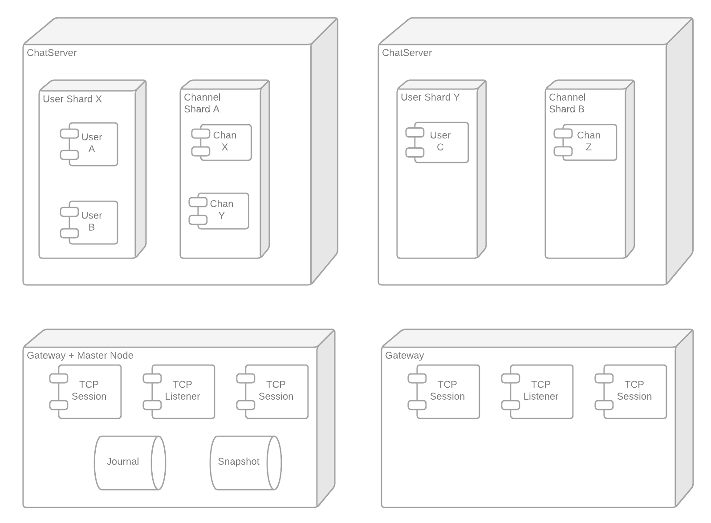

# Demo-Actor

This project implements a simple IRC-like service for the sake of demonstrating
what Actor Modeling is and how simple it can be to implement a complex solution.

One of the main controversy about Actor Modeling relates to its Statefulness,
in this demo I intend to demonstrate how the location transparency can be used
to discretly relocates an actor.

## Architecture

### Components


There are two application in this project, the Gateway and the ChatServer.
This project is splitting the Gateway and the Chat Server in two applications
for the sake of the demonstration where I intend to roll-out updates of the Chat servers
which will relocates the User and Channel actors without cutting the user facing connections.

#### Gateway

As you would expect the Gateway act as entrypoint to this service. It provides a simple TCP interface and
it will create a new Actor, the TCP Session for every new connections.
The TCP Session implements a text protocol which is used to transcribe
the user request to the internal protocol.

Here is the text protocol:
```
[/help] will show you this message
[/login $userName] will log you in the channel with the given user name
[/users] will list the connected users in the channel
[/pm $toUserName $msg] will send a private message to a specific user in the channel
[$msg] will send a message to everybody in the channel
```

The TCP Session also act as a Proxy to forwards the incoming messages back to the user.

#### ChatServer

The ChatServer define how the users can communicate together.

The User component implements every actions an user should be able to perform
and is meant to modelise a specific User to the rest of the system.
For example, it can receive messages, send messages, send private messages, join a channel, etc.

The Channel modelise the idea of grouping users, where it is possible
to list the connected users or send a message to every member of this group.

### Clustering



To be able to easily locate and relocate the users and the channels, I decided to implement
both Actors with Akka Cluster Sharding and Akka Persistence.
Every Events generated by the Channels or the Users will update the EventLog
on a shared Master Node, this EventLog will be used to re-build the state
of the Actors while being relocated.

## How to run

First you need to start the Master Node, which is also used to host
the TCP Listener:
> $> sbt "run 8080"

And then when requested to select the Main to execute, enter:
> $> 2

Now to be complete, the application expect at least an extra node in the cluster
plus you still need to run the ChatServer.
To do so:
> $> sbt "run 2552"

And then when requested to select the Main to execute, enter:
> $> 1

From this point, you should have a working setup.
If you want you can increase the number ChatServer by reproducing the previous step and changing the port number.

## How to use it

With the previous step running, you can start connecting to the TCP interface:
> $> nc localhost 8080

Once connected, you should be able to use the previously described commands:
```
[/help] will show you this message
[/login $userName] will log you in the channel with the given user name
[/users] will list the connected users in the channel
[/pm $toUserName $msg] will send a private message to a specific user in the channel
[$msg] will send a message to everybody in the channel
```

Example:
```
$> nc localhost 8080
/login Gaston
joined the channel 'mainChannel'
/users
the connected users are: Gaston
Siffert: joined the channel
Hello
Siffert: World
```

```
$> nc localhost 8080
/login Siffert
joined the channel 'mainChannel'
/users
the connected users are: Gaston, Siffert
Gaston: Hello
World
```
